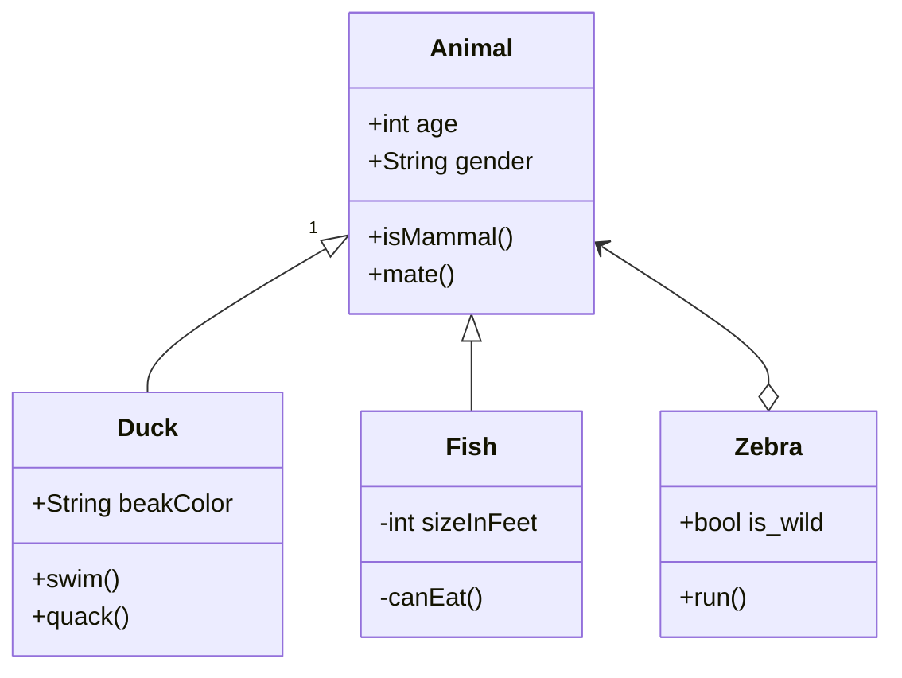
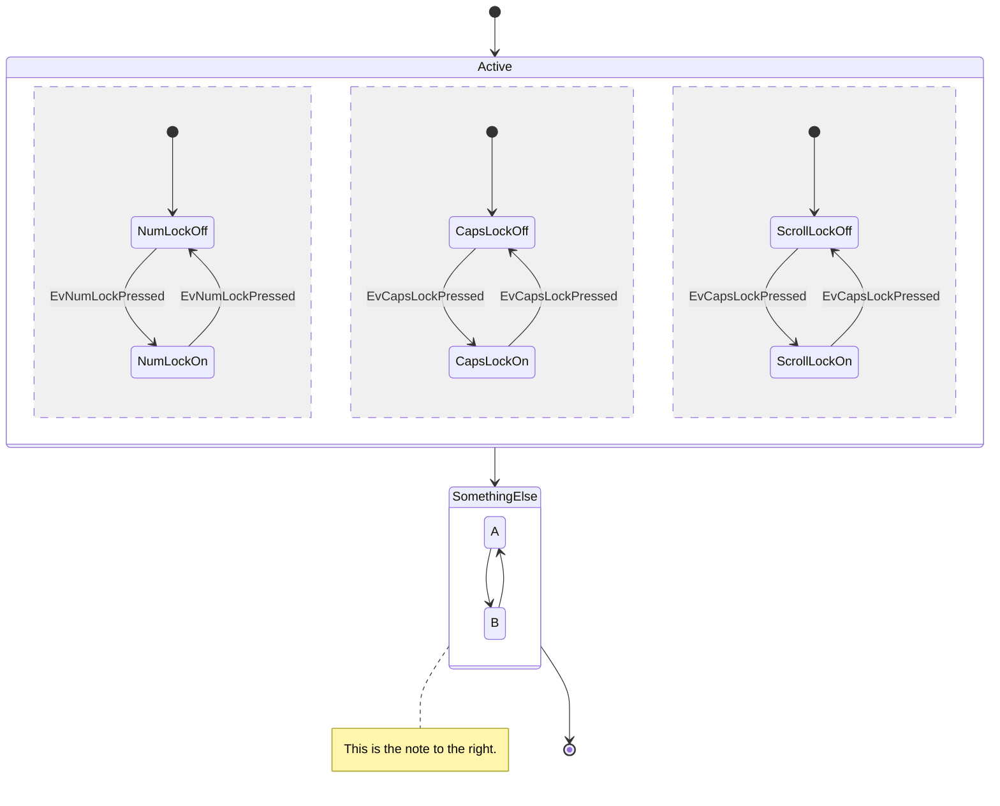
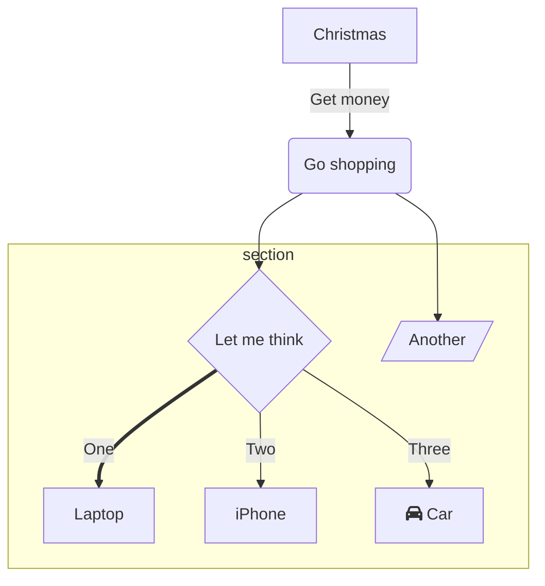

# This is a location for all code snippets related to this project

## Code Snippets

### C++

```cpp

void InitJsonData()
{
  String json = "";
  json += R"====({)====";

  json += R"====("stack_humidity":)====";
  json += (String)cfg.config.stack_humidity + ",\n";

  json += R"====("stack_temp":)====";
  json += (String)cfg.config.stack_temp + ",\n";

  json += R"====("relays":[)====";
  json += (String) cfg.config.relays[0] + "," + (String) cfg.config.relays[1] + "," +  (String) cfg.config.relays[2] + "," +  (String) cfg.config.relays[3] + "," +  (String) cfg.config.relays[4] + "],\n";

  json += R"====("stack_voltage":)====";
  json += (String)cfg.config.stack_voltage + ",\n";

  json += R"====("GraphData":[)====";
  json +=  "\n";
  for (int i = 0; i < 10; i++) 
  {
      delay(0);
      json += R"====({"label": "🌡 )====" + (String)i + "\",\n";
      json += R"====("type": "temp",)====" + (String)"\n";
      json += R"====("value": )====" + (String)cfg.config.cell_temp[i] + (String)",\n";
      json += R"====("maxValue": )====" + (String) maxTemp;
      json += R"====(})====" + (String)"\n";
      json += R"====(,)====";

      json += R"====({"label": "⚡ )====" + (String)i + "\",\n";
      json += R"====("type": "volt",)====" + (String)"\n";
      json += R"====("value": )====" + (String)cfg.config.cell_voltage[i] + (String)",\n";
      json += R"====("maxValue": )====" + (String) maxVoltage;
      json += R"====(})====" + (String)"\n";

      if (i < 9) {
          json += R"====(,)====";
      };
  }
  json += R"====(])====";
  json += R"====(})====";
  MqttData.MQTTPublish("/HMS" ,json);
}
```

```cpp
#define LARGE_NUMBER 12333
void my_delay(void) {
    for (volatile long count = LARGE_NUMBER ; count > 0; count--) ;
}
```

### C

```c


```

### JSON

```json


```

### Mermaid







## Calculate the range of Wifi signal strength

´´´txt
Signal transmission in ft^2 = ((dBm + 4,000) - 2,000) / 42.7

4,000 = nominal base dB of average consumer grade WIFI antenna
2,000 = Nominal base dB of peak signal interference
42.7 = a constant for conversion to square feet
´´´

```cpp
int signal_range = ((dBm + 4,000) - 2,000) / 42.7;

WiFi.setOutputPower(dBm);

1. For how long can a device be without connection?
2. What happens if data is lost?

From the point of view of the client:
a: How low is to low - when is the client not able to see the server
b: How close to this lowest point are we willing to go?


1. Client tells the server when it needs a stronger signal - do this in levels
2. Server lowers signal by a certain value each time frame 
3. Every x amount of time based on how long device can be without connection - it will pulse the signal at max sending out a wake up call to devices that have potentially lost connection
```

```cpp
if (!PRODUCTION) {
  // do development stuff
}
```

## USEFUL LINKS

[Mermaid Live Editor](https://mermaid-js.github.io/mermaid-live-editor/edit#eyJjb2RlIjoiZ3JhcGggVERcbiAgICBBW0NocmlzdG1hc10gLS0-fEdldCBtb25leXwgQihHbyBzaG9wcGluZylcbiAgICBCIC0tPiBDe0xldCBtZSB0aGlua31cbiAgICBDIC0tPnxPbmV8IERbTGFwdG9wXVxuICAgIEMgLS0-fFR3b3wgRVtpUGhvbmVdXG4gICAgQyAtLT58VGhyZWV8IEZbZmE6ZmEtY2FyIENhcl0iLCJtZXJtYWlkIjoie1xuICBcInRoZW1lXCI6IFwiYmFzZVwiXG59IiwidXBkYXRlRWRpdG9yIjpmYWxzZSwiYXV0b1N5bmMiOnRydWUsInVwZGF0ZURpYWdyYW0iOmZhbHNlfQ)

[Wifi QR code generator](https://qifi.org/)
